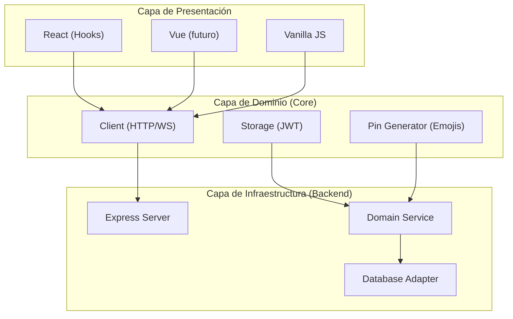
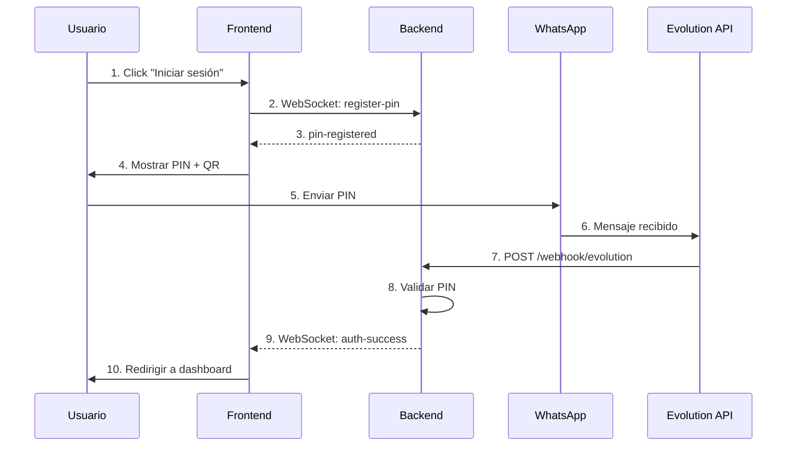
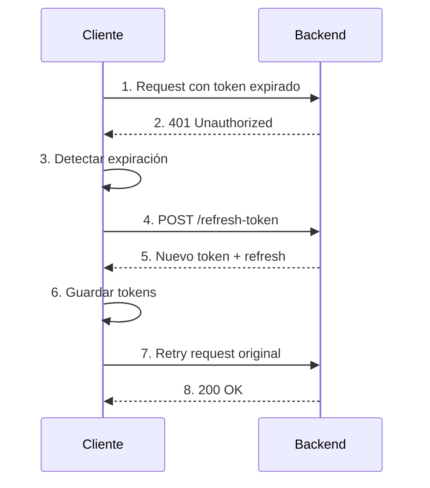
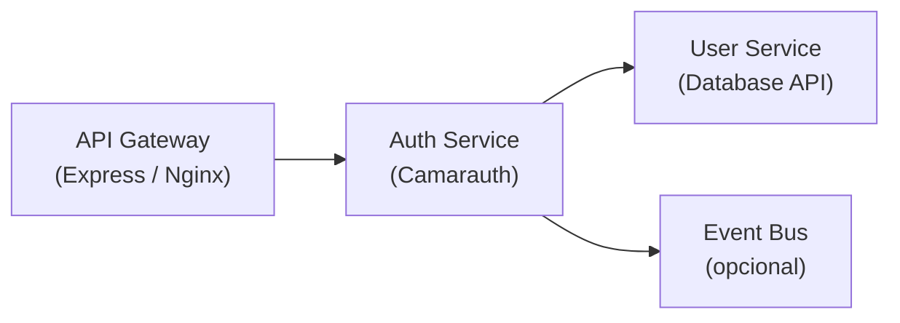

# Arquitectura del SDK

Esta guía te ayudará a entender cómo está construido Camarauth SDK, independientemente de tu nivel de experiencia.

## Visión General

Camarauth SDK está diseñado con una arquitectura modular que separa claramente las responsabilidades. Esto permite usar solo las partes que necesites y facilita las pruebas.



## Principios de Diseño

### 1. Separación de Responsabilidades

Cada módulo tiene una única responsabilidad bien definida:

- **Core**: Lógica de negocio universal (no depende de framework)
- **React**: Componentes específicos de React
- **Backend**: Servidor Express con Socket.IO
- **Server**: Middleware y utilidades

### 2. Inversión de Dependencias

Las dependencias apuntan hacia abajo (hacia el core). Esto significa que:

<CodeGroup>

```typescript ❌ Acoplamiento Fuerte
// El backend depende directamente de PostgreSQL
import { Pool } from 'pg';

class Backend {
  constructor(private db: Pool) {}
}
```

```typescript ✅ Desacoplamiento
// El backend depende de una abstracción
interface DatabaseAdapter {
  query(text: string, values?: unknown[]): Promise<QueryResult>;
}

class Backend {
  constructor(private db: DatabaseAdapter) {}
}

// PostgreSQLAdapter implementa la interfaz
class PostgreSQLAdapter implements DatabaseAdapter {
  constructor(private pool: Pool) {}
  async query(text: string, values?: unknown[]) {
    return this.pool.query(text, values);
  }
}
```

</CodeGroup>

### 3. Configuración sobre Convención

El SDK permite personalizar casi todo mediante configuración:

<AccordionGroup>
  <Accordion title="Storage Adapter">
    Puedes usar localStorage, sessionStorage, memory, o crear tu propio adaptador.
  </Accordion>
  <Accordion title="Logger">
    Puedes usar el logger de desarrollo, producción, o implementar tu propio StructuredLogger.
  </Accordion>
  <Accordion title="Time Provider">
    Para testing, puedes usar FakeTimeProvider para controlar el tiempo.
  </Accordion>
  <Accordion title="Rate Limiting">
    Configurable por endpoint, ventana de tiempo, y número de requests.
  </Accordion>
</AccordionGroup>

## Flujo de Datos

### Autenticación Completa



### Refresh de Token



## Módulos del SDK

### Core (`camarauth-sdk`)

Lógica de negocio universal que funciona en cualquier entorno JavaScript.

<CardGroup cols={2}>
  <Card title="CamarauthClient" icon="computer-desktop" href="/core/overview">
    Cliente HTTP para comunicación REST
  </Card>
  <Card title="CamarauthSocketClient" icon="bolt" href="/core/overview">
    Cliente WebSocket para tiempo real
  </Card>
  <Card title="Storage" icon="circle-stack" href="/core/storage">
    Sistema de almacenamiento adaptable
  </Card>
  <Card title="JWT Utils" icon="shield-check" href="/core/jwt-utils">
    Utilidades para manejo de tokens
  </Card>
</CardGroup>

### Backend (`camarauth-sdk/backend`)

Servidor Express completo con WebSockets.

<CardGroup cols={2}>
  <Card title="CamarauthBackend" icon="server" href="/backend/classes/camarauth-backend">
    Clase principal del servidor
  </Card>
  <Card title="DatabaseAdapter" icon="database" href="/backend/database-adapter">
    Abstracción para cualquier base de datos
  </Card>
  <Card title="Rate Limiting" icon="funnel" href="/backend/configuration">
    Protección contra abuso
  </Card>
  <Card title="Webhook Handler" icon="globe-alt" href="/backend/overview">
    Integración con Evolution API
  </Card>
</CardGroup>

### React (`camarauth-sdk/react`)

Hooks y componentes para aplicaciones React.

<CardGroup cols={2}>
  <Card title="usePinAuth" icon="key" href="/react/hooks/use-pin-auth">
    Hook orquestador principal
  </Card>
  <Card title="AuthProvider" icon="user-circle" href="/react/overview">
    Contexto de autenticación
  </Card>
  <Card title="Hooks Granulares" icon="puzzle-piece" href="/react/hooks/use-pin-generator">
    usePinGenerator, useCountdown, etc.
  </Card>
</CardGroup>

## Patrones de Diseño

### Dependency Injection

Las dependencias se inyectan mediante constructores:

```typescript
const backend = new CamarauthBackend({
  db: new PostgreSQLAdapter(pool),
  logger: createProductionLogger(),
  timeProvider: new FakeTimeProvider()
});
```

### Factory Method

Creación de objetos sin especificar la clase exacta:

```typescript
// Detecta automáticamente el mejor storage disponible
const storage = createAuthStorage();
// Puede retornar LocalStorage, SessionStorage o MemoryStorage
```

### Observer (EventEmitter)

Para notificaciones asíncronas:

```typescript
backend.on('auth:verified', ({ userId, phoneNumber }) => {
  console.log(`Usuario ${userId} verificado`);
});
```

### Repository

Abstracción de acceso a datos:

```typescript
class PinRepository {
  create(pin: PinData): Promise<void>;
  findByPin(pin: string): Promise<PinData | null>;
  update(id: string, data: Partial<PinData>): Promise<void>;
  delete(id: string): Promise<void>;
}
```

## Decisiones Arquitectónicas

### ¿Por qué WebSockets?

Los WebSockets proporcionan comunicación bidireccional en tiempo real. Esto permite:

- Notificación inmediata cuando el PIN es verificado
- Experiencia de usuario fluida sin polling
- Menor latencia que HTTP polling

### ¿Por qué JWT?

JSON Web Tokens son:

- Stateless: No requieren sesión en servidor
- Escalables: Fácil de escalar horizontalmente
- Seguros: Firmados y con expiración
- Universales: Estándar de la industria

### ¿Por qué DatabaseAdapter?

El patrón Adapter permite:

- Cambiar de PostgreSQL a MongoDB sin modificar el dominio
- Testing con mocks fácilmente
- Soporte para múltiples bases de datos simultáneamente

## Escalabilidad

### Horizontal Scaling

Para múltiples instancias del backend:

<Warning>
Cuando escales horizontalmente (múltiples servidores), necesitas:
</Warning>

1. **Base de datos compartida**: Todos los servidores deben usar la misma DB
2. **Redis para sesiones**: Compartir estado de PINs entre instancias
3. **Load balancer**: Distribuir requests entre instancias
4. **Sticky sessions**: Mantener conexiones WebSocket

```typescript
// Ejemplo con Redis
const backend = new CamarauthBackend({
  db: new RedisAdapter(redisClient),
  // ...
});
```

### Microservicios

El SDK está diseñado para poder separarse en microservicios:



## Seguridad

<Check>El SDK implementa múltiples capas de seguridad:</Check>

- **Rate Limiting**: Protección contra fuerza bruta
- **JWT**: Tokens firmados con expiración
- **CORS**: Orígenes explícitamente permitidos
- **Webhook Validation**: Firma HMAC para webhooks
- **Input Validation**: Validación de todos los inputs
- **Timing Safe Comparison**: Comparación segura de hashes

## Para Desarrolladores Avanzados

### Extensibilidad

Puedes extender el SDK implementando tus propios adaptadores:

```typescript
// Adaptador de base de datos personalizado
class DynamoDBAdapter implements DatabaseAdapter {
  constructor(private client: DynamoDBClient) {}
  
  async query<Row>(text: string, values?: unknown[]) {
    // Implementación DynamoDB
  }
}

// Usar adaptador personalizado
const backend = new CamarauthBackend({
  db: new DynamoDBAdapter(dynamoClient)
});
```

### Testing

El SDK está diseñado para ser altamente testeable:

```typescript
// Testing con FakeTimeProvider
const fakeTime = new FakeTimeProvider();
const backend = new CamarauthBackend({
  timeProvider: fakeTime
});

// Avanzar tiempo en tests
fakeTime.advance(5 * 60 * 1000); // 5 minutos
```

### Eventos Personalizados

Puedes escuchar y reaccionar a eventos del backend:

```typescript
backend.on('auth:verified', async (data) => {
  // Enviar email de bienvenida
  await sendWelcomeEmail(data.userData.email);
  
  // Registrar en analytics
  analytics.track('User Verified', data);
  
  // Actualizar CRM
  await crm.updateUser(data.userId, { lastLogin: new Date() });
});
```

## Referencias

- [Backend Overview](/backend/overview)
- [Core Overview](/core/overview)
- [React Overview](/react/overview)
- [Testing Guide](/guides/testing)
