# Flujo de Autenticación

Esta guía explica en detalle cómo funciona el proceso de autenticación con Camarauth SDK, desde que el usuario hace click hasta que está autenticado.

## Diagrama de Secuencia

```mermaid
sequenceDiagram
    actor U as Usuario
    participant F as Frontend (React)
    participant B as Backend (Node.js)
    participant DB as Base de Datos
    participant E as Evolution API
    participant W as WhatsApp

    Note over U,B: Fase 1 - Generación del PIN
    U->>F: 1. Click "Iniciar sesión"
    F->>B: 2. WebSocket: register-pin
    B->>DB: 3. INSERT pin
    DB-->>B: 4. Confirmación
    B-->>F: 5. Evento: pin-registered
    F->>U: 6. Mostrar QR + Link

    Note over U,B: Fase 2 - Verificación por WhatsApp
    U->>W: 7. Enviar PIN
    W->>E: 8. Mensaje recibido
    E->>B: 9. POST /webhook/evolution

    Note over B,F: Fase 3 - Autenticación exitosa
    B->>DB: 10. SELECT usuario
    DB-->>B: 11. Datos del usuario
    B->>B: 12. Generar JWT
    B->>DB: 13. UPDATE pin (verified)
    B-->>F: 14. Evento: auth-success
    F->>U: 15. Redirigir al dashboard
```



## Fase 1: Generación del PIN

### 1. Usuario inicia el proceso

El usuario hace click en "Iniciar sesión" en la aplicación frontend.

### 2. Frontend solicita PIN

```typescript
// React Component
const { generate } = usePinAuth({
  apiUrl: 'http://localhost:3001',
  whatsappNumber: '+34600123456'
});

// Al hacer click
await generate();
```

Internamente, esto:
1. Genera un PIN aleatorio (ej: `ABC123`)
2. Codifica el PIN en emojis (ej: `🎉🔥✨`)
3. Crea un link de WhatsApp
4. Genera un código QR

### 3. Backend registra el PIN

```typescript
// Backend recibe vía WebSocket
socket.emit('register-pin', {
  pin: 'ABC123',
  emojiString: '🎉🔥✨'
});

// Backend guarda en DB
{
  id: 'uuid',
  pin: 'ABC123',
  emojiString: '🎉🔥✨',
  status: 'pending',
  expiresAt: Date.now() + (3 * 60 * 1000), // 3 minutos
  socketId: 'socket-id'
}
```

### 4. Frontend muestra al usuario

```tsx
// El usuario ve:
<div>
  
  <div>Tu código: 🎉 🔥 ✨</div>
  <a href={whatsappLink}>Abrir WhatsApp</a>
  <div>Expira en: 02:59</div>
</div>
```

## Fase 2: Verificación por WhatsApp

### 5. Usuario envía el PIN

El usuario abre WhatsApp (escaneando el QR o haciendo click en el link) y envía los emojis al número de negocio.

### 6. Evolution API recibe el mensaje

Evolution API (conectada a tu instancia de WhatsApp Business) detecta el mensaje entrante.

### 7. Webhook al backend

Evolution API envía un webhook a tu backend:

```json
{
  "event": "messages.upsert",
  "instance": "mi-instancia",
  "data": {
    "key": {
      "remoteJid": "34600123456@s.whatsapp.net",
      "fromMe": false
    },
    "pushName": "Juan Pérez",
    "message": {
      "conversation": "🎉🔥✨"
    }
  }
}
```

### 8. Backend decodifica y verifica

```typescript
// Backend extrae los emojis
const emojiString = '🎉🔥✨';

// Decodifica a PIN
const pin = decodeEmojis(emojiString); // 'ABC123'

// Busca en la base de datos
const pinData = await db.query(
  'SELECT * FROM pins WHERE pin = $1 AND status = $2',
  [pin, 'pending']
);

// Verifica que no haya expirado
if (pinData.expiresAt < Date.now()) {
  throw new Error('PIN_EXPIRED');
}
```

## Fase 3: Autenticación Exitosa

### 9. Buscar usuario

El backend busca el usuario asociado al número de teléfono:

```typescript
const user = await db.query(
  'SELECT * FROM users WHERE telefono = $1',
  [phoneNumber]
);
```

### 10. Generar tokens JWT

```typescript
// Access token (15 minutos)
const token = jwt.sign(
  { userId: user.id, roles: user.roles },
  JWT_SECRET,
  { expiresIn: '15m' }
);

// Refresh token (7 días)
const refreshToken = jwt.sign(
  { userId: user.id, type: 'refresh' },
  JWT_SECRET,
  { expiresIn: '7d' }
);
```

### 11. Notificar al frontend

```typescript
// Backend envía vía WebSocket
io.to(socketId).emit('auth-success', {
  success: true,
  verified: true,
  token,
  refreshToken,
  user: {
    id: user.id,
    name: user.nombre,
    phone: user.telefono,
    roles: user.roles
  }
});
```

### 12. Frontend autentica al usuario

```typescript
// Hook usePinAuth recibe el evento
socket.on('auth-success', async (response) => {
  if (response.verified && response.token) {
    // Guardar tokens
    await storage.save({
      token: response.token,
      refreshToken: response.refreshToken,
      user: response.user
    });
    
    // Actualizar estado
    setUser(response.user);
    setStatus('success');
    
    // Callback de éxito
    onSuccess?.(response.user);
  }
});
```

### 13. Redirigir al dashboard

```tsx
// En tu componente
if (status === 'success') {
  return <Navigate to="/dashboard" />;
}

// O muestra mensaje de bienvenida
return (
  <div>
    <h1>¡Bienvenido, {user.name}!</h1>
    <button onClick={logout}>Cerrar sesión</button>
  </div>
);
```

## Refresh Token

Cuando el access token expira (15 minutos), se usa el refresh token para obtener uno nuevo:


## Logout

```mermaid
sequenceDiagram
    participant C as Cliente
    participant B as Backend
    participant DB as Base de Datos
    
    C->>B: 1. POST /logout
    B->>DB: 2. DELETE/UPDATE session
    B-->>C: 3. Confirmación
    C->>C: 4. Limpiar storage
    C->>C: 5. Redirigir a login
```



## Estados del PIN


## Consideraciones de Seguridad

<Check>
- Los PINs expiran en 3 minutos por defecto
- Solo se puede usar una vez
- Rate limiting evita fuerza bruta
- Tokens JWT tienen expiración corta (15 min)
- Refresh tokens rotan en cada uso
</Check>

## Para Desarrolladores

### Debugging

Para debuggear el flujo:

```typescript
// Backend: logs detallados
backend.on('auth:verified', (data) => {
  console.log('Auth verified:', data);
});

// Frontend: logs de socket
socket.on('connect', () => {
  console.log('Socket connected');
});

socket.on('pin-registered', (data) => {
  console.log('PIN registered:', data);
});

socket.on('auth-success', (data) => {
  console.log('Auth success:', data);
});
```

### Testing

```typescript
// Simular flujo completo en tests
const pin = await generatePin();
await registerPin(pin);
await simulateWebhook(pin); // Simular mensaje de WhatsApp
const auth = await waitForAuth();
expect(auth.token).toBeDefined();
```
