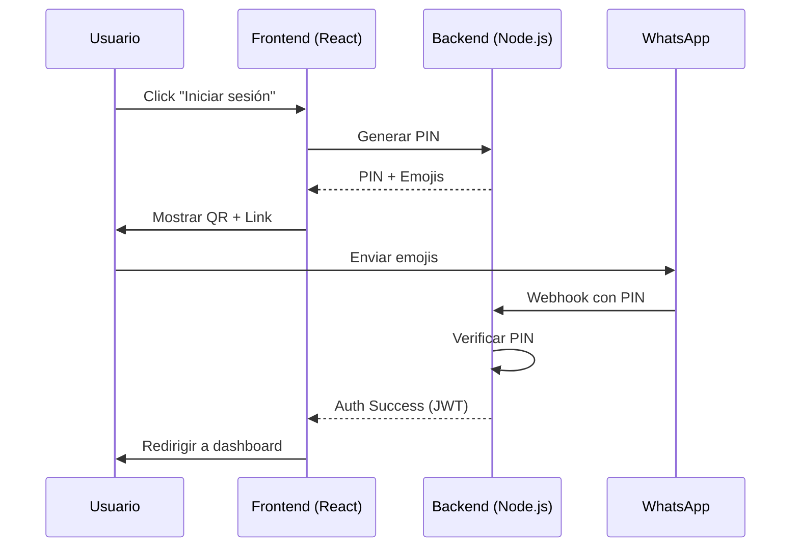

# Camarauth SDK

## Autenticación segura por WhatsApp

Camarauth SDK te permite integrar autenticación sin contraseñas usando WhatsApp en tus aplicaciones. Los usuarios reciben un PIN codificado en emojis que deben enviar a tu número de WhatsApp para verificar su identidad.

<CardGroup cols={2}>
  <Card title="Node.js Backend" icon="node" href="/backend/quickstart">
    Implementa el backend de autenticación con Express y Socket.IO
  </Card>
  <Card title="React Frontend" icon="react" href="/react/quickstart">
    Integra la autenticación en tus aplicaciones React
  </Card>
</CardGroup>

## Características principales

- 🔐 **Autenticación sin contraseñas** - Los usuarios no necesitan recordar contraseñas
- 📱 **WhatsApp como canal** - Usa la app que todos tienen instalada
- 🎭 **PINs codificados en emojis** - Fácil de recordar y copiar
- ⚡ **Tiempo real** - WebSockets para respuesta inmediata
- 🔄 **Auto-regeneración** - PINs se regeneran automáticamente si expiran
- 🛡️ **JWT seguros** - Tokens con refresh automático
- 📦 **Fácil integración** - SDK completo para Node.js y React

## Flujo de autenticación



## Instalación rápida

### Backend

```bash
npm install @camarauth/sdk
```

```typescript
import { CamarauthBackend } from '@camarauth/sdk/server';

const backend = new CamarauthBackend({
  evolutionApiUrl: 'https://tu-evolution-api.com',
  evolutionApiKey: 'tu-api-key',
  evolutionInstanceName: 'mi-instancia'
});

backend.start();
```

### Frontend

```bash
npm install @camarauth/sdk
```

```typescript
import { usePinAuth } from '@camarauth/sdk/react';

function LoginComponent() {
  const { pin, emojis, whatsappLink, qrCodeUrl, generate } = usePinAuth({
    apiUrl: 'http://localhost:3001',
    whatsappNumber: '+1234567890'
  });

  return (
    <div>
      <button onClick={generate}>Generar PIN</button>
      {qrCodeUrl && }
      <a href={whatsappLink}>Abrir WhatsApp</a>
    </div>
  );
}
```

## Soporte de plataformas

<CardGroup cols={3}>
  <Card title="Node.js" icon="node" href="/sdks/nodejs">
    Backend y servidor
  </Card>
  <Card title="React" icon="react" href="/sdks/react">
    Frontend web
  </Card>
  <Card title="Python" icon="python" href="/sdks/python">
    Próximamente
  </Card>
  <Card title="Go" icon="golang" href="/sdks/go">
    Próximamente
  </Card>
  <Card title="Rust" icon="rust" href="/sdks/rust">
    Próximamente
  </Card>
  <Card title="Java" icon="java" href="/sdks/java">
    Próximamente
  </Card>
</CardGroup>
