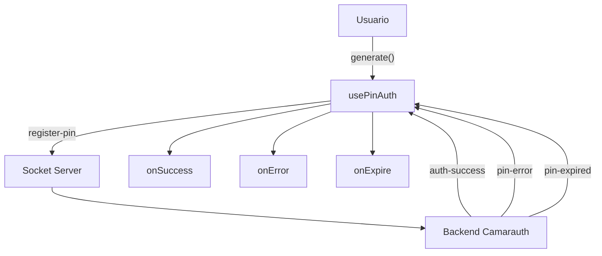

# React SDK

El SDK de React proporciona hooks y utilidades para integrar autenticación por WhatsApp en tus aplicaciones React.

## Instalación

```bash
npm install @camarauth/sdk
# o
yarn add @camarauth/sdk
# o
pnpm add @camarauth/sdk
```

## Hooks disponibles

<CardGroup cols={2}>
  
  <Card title="usePinAuth" icon="hook" href="/react/hooks/use-pin-auth">
    Hook principal que orquesta todo el flujo de autenticación.
    Incluye generación de PINs, WebSocket, countdown y más.
  </Card>
  
  <Card title="usePinGenerator" icon="random" href="/react/hooks/use-pin-generator">
    Genera PINs aleatorios y los codifica en emojis.
    Útil si necesitas control de bajo nivel.
  </Card>
  
  <Card title="useCountdown" icon="clock" href="/react/hooks/use-countdown">
    Temporizador para la expiración del PIN.
    Formato automático MM:SS.
  </Card>
  
  <Card title="useAutoRegeneration" icon="refresh" href="/react/hooks/use-auto-regeneration">
    Controla el número de regeneraciones automáticas.
    Previene loops infinitos.
  </Card>

</CardGroup>

## Características

- ✅ **Hooks React** - Integración nativa con React
- ✅ **TypeScript** - Tipos completos incluidos
- ✅ **WebSocket** - Conexión en tiempo real
- ✅ **Auto-regeneración** - PINs se regeneran automáticamente
- ✅ **Storage** - Persistencia de sesión opcional
- ✅ **Responsive** - Funciona en móvil y desktop
- ✅ **Server-Side Rendering** - Compatible con Next.js

## Ejemplo básico

```tsx
import { usePinAuth } from '@camarauth/sdk/react';

function LoginPage() {
  const auth = usePinAuth({
    apiUrl: 'http://localhost:3001',
    whatsappNumber: '+1234567890',
    onSuccess: (user) => {
      console.log('Autenticado:', user);
      // Redirigir...
    }
  });

  return (
    <div>
      {!auth.pin ? (
        <button onClick={auth.generate}>Generar PIN</button>
      ) : (
        <div>
          <p>{auth.emojis.join(' ')}</p>
          <p>Expira en: {auth.formattedTime}</p>
          
          <a href={auth.whatsappLink}>Abrir WhatsApp</a>
        </div>
      )}
    </div>
  );
}
```

## Flujo de datos



## Siguientes pasos

- [Instalación](/react/installation)
- [Quickstart](/react/quickstart)
- [Documentación de hooks](/react/hooks/use-pin-auth)
- [Interfaces TypeScript](/react/interfaces/pin-auth-options)
